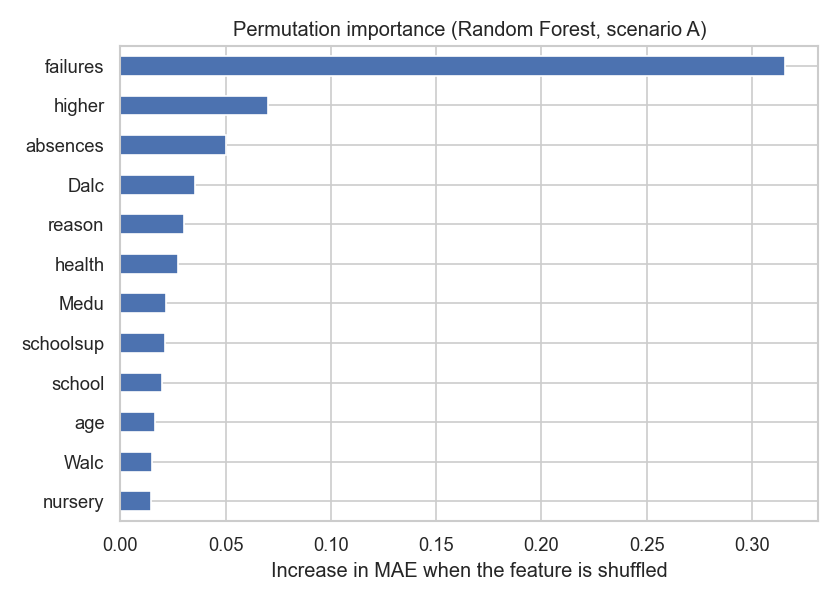
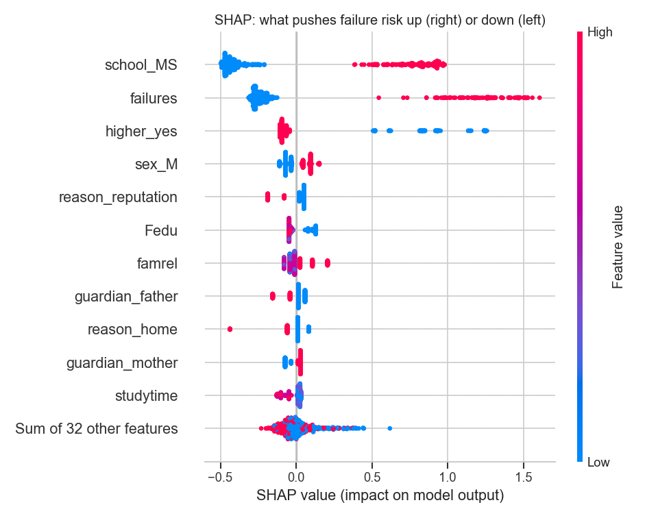

**English** | [Português](README.pt.md)

# Secondary School Student Performance

Exploratory analysis and predictive modelling of final grades for students at two Portuguese secondary schools.

**Data:** [UCI Student Performance](https://archive.ics.uci.edu/dataset/320), from Cortez & Silva (2008). It covers 649 students (Portuguese language) and 395 students (Maths).

## Question
Which factors are associated with the final grade (`G3`, 0–20)? And can we flag at-risk students **at the start of the year**, before any grades exist?

## Key findings (Portuguese language)
- **Past class failures** are the strongest background factor (r ≈ −0.39). The mean grade falls from 12.5 (no failures) to around 8.5.
- **15 students scored 0** on the final grade. The pattern suggests mid-year dropout: they had a 1st-term grade but zero recorded absences.
- **Extra school support** is linked to *lower* grades, a clear case of reverse causation (support goes to students who are already struggling).
- 5-fold cross-validation:

| Scenario | Model | MAE | R² |
|---|---|---|---|
| Early warning (no G1/G2) | Baseline (mean) | 2.41 | 0.00 |
| | Ridge | 1.98 | 0.26 |
| | Random Forest | 1.99 | 0.29 |
| Mid-year (with G1/G2) | Random Forest | 0.80 | 0.85 |



## Deeper analysis (notebook 02)
- **Early-warning classifier:** catching 80% of failing students means flagging about a third of the cohort, and about 1 in 3 flagged students actually fails. The alert threshold matters more than the algorithm.
- **Zero grades are dropouts:** in both subjects, every student with G3 = 0 has zero recorded absences. Removing them halves the mid-year error in Maths.
- **Maths vs Portuguese:** the fail rate doubles in Maths (33% vs 15%). For the 382 students in both files, grades correlate only moderately (r ≈ 0.48), and **the gender gap reverses**: girls do better in Portuguese, boys in Maths.
- **Gradient boosting + SHAP:** no gain over random forest on 649 students. SHAP shows the school, past failures and university ambition drive predictions.



## Interactive dashboard
```bash
streamlit run app/app.py
```
Overview, factor explorer and an early-warning risk calculator for both subjects.

## Project structure
```
data/raw/        original data (created by the download script)
notebooks/       01_eda_and_baseline.ipynb, 02_deeper_analysis.ipynb
app/             app.py (Streamlit dashboard)
src/             download_data.py
figures/         plots exported by the notebook
```

## How to run
```bash
pip install -r requirements.txt
python src/download_data.py
jupyter notebook notebooks/01_eda_and_baseline.ipynb
```

## Reference
Cortez, P. & Silva, A. (2008). *Using Data Mining to Predict Secondary School Student Performance.* Proceedings of the 5th FUture BUsiness TEChnology Conference (FUBUTEC 2008), pp. 5–12.
