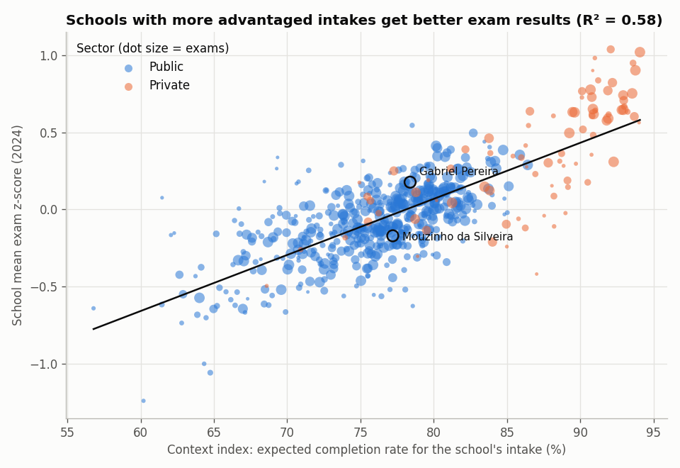
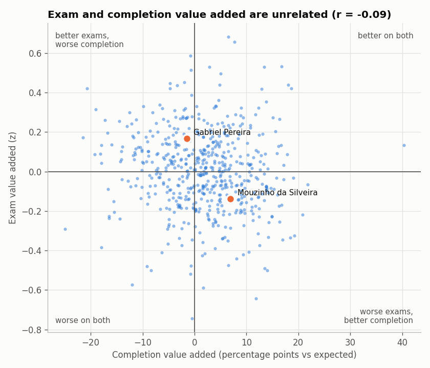

[English](README.md) | **Português**

# Desigualdade entre Escolas nos Exames Nacionais (2024)

Quanto do resultado de uma escola nos exames se explica pelo contexto dos seus alunos? Que escolas fazem melhor do que o esperado? E as conclusões de um estudo conhecido de 2005/06, feito em duas escolas portuguesas, ainda se verificam hoje a nível nacional?

Este projeto dá continuidade ao [student-performance](../projeto_student_performance), que analisou 649 alunos de duas escolas em 2005/06.

> Os notebooks e o código estão em inglês, para chegar a um público mais alargado.

## Dados
| Fonte | O quê | Nível |
|---|---|---|
| [ENES 2024](https://www.dge.mec.pt/relatoriosestatisticas-0) (Júri Nacional de Exames / DGE) | Os 311 909 exames nacionais do secundário realizados em 2024 | Uma linha por exame |
| [Infoescolas](https://infoescolas.medu.pt/bds.asp) (DGEEC, edição de fev. 2025) | Taxas de conclusão, retenção e conclusão *esperada* dado o perfil socioeconómico dos alunos | Escola e município, 2022/23 |

As duas fontes estão ligadas pelo código DGEEC de cada escola (93% dos registos de exames têm correspondência).

## Principais resultados
1. **O perfil dos alunos de uma escola explica cerca de 58% da variação nos seus resultados nos exames.** Os rankings "em bruto" medem sobretudo quem a escola recebe.

   

2. **A vantagem em bruto das escolas privadas (0,45 desvios-padrão) desce para 0,05** quando se tem em conta o perfil dos alunos.
3. **Uma "boa escola" depende da métrica.** O valor acrescentado nos exames e o valor acrescentado na conclusão do secundário no tempo esperado não estão relacionados (r = −0,09).

   

4. **A desigualdade é sobretudo local.** A percentagem de alunos com Ação Social Escolar (ASE) em cada município tem uma correlação fraca com os resultados (r = −0,23). As diferenças entre escolas próximas pesam mais do que as diferenças entre regiões.
5. **Antes e agora (2005/06 → 2024):**
   - Os alunos que ficaram para trás continuam a ter resultados muito piores (até −5 valores em Matemática A aos 19 anos).
   - As raparigas continuam à frente a Português (+0,8).
   - A vantagem dos rapazes a Matemática desapareceu entre quem faz exame, possivelmente por causa de quem escolhe fazê-lo.
   - A Gabriel Pereira continua à frente da Mouzinho da Silveira nos exames, mas a Mouzinho sai-se melhor na conclusão do secundário face ao perfil dos seus alunos.

⚠️ **Principal ressalva:** em 2024, 98% dos exames foram feitos para acesso ao ensino superior. Os dados descrevem por isso **candidatos ao superior**, não todos os alunos.

## Estrutura
```
src/download_data.py     descarrega os ficheiros ENES 2024 e Infoescolas para data/raw/
src/build_dataset.py     lê a base de dados Access e os Excel e escreve ficheiros parquet em data/processed/
src/style.py             estilo comum dos gráficos
notebooks/01_exam_results_2024.ipynb    nível do aluno: disciplinas, sexo, idade, nota interna vs exame, antes e agora
notebooks/02_schools_and_context.ipynb  nível da escola: contexto, valor acrescentado, municípios, as duas escolas do estudo UCI
figures/                 gráficos exportados
```

## Como correr
```bash
pip install -r requirements.txt
python src/download_data.py
python src/build_dataset.py
jupyter notebook notebooks/
```
O `build_dataset.py` lê o ficheiro Access (.mdb) com o `access-parser`, escrito só em Python. Funciona em Windows, macOS e Linux e demora cerca de um minuto.

## Limitações
- Quem faz exame em 2024 são candidatos ao superior que escolheram fazê-lo.
- O contexto do Infoescolas refere-se às coortes de 2022/23; os exames são de 2024.
- O índice de contexto é a expectativa calculada pela DGEEC a partir de poucas variáveis (idade, ASE, escolaridade da mãe, natureza pública/privada). Não é uma medida socioeconómica completa.
- Só um ano de exames. O valor acrescentado de cada escola deve ser calculado com vários anos antes de se tirarem conclusões sobre uma escola em particular.
